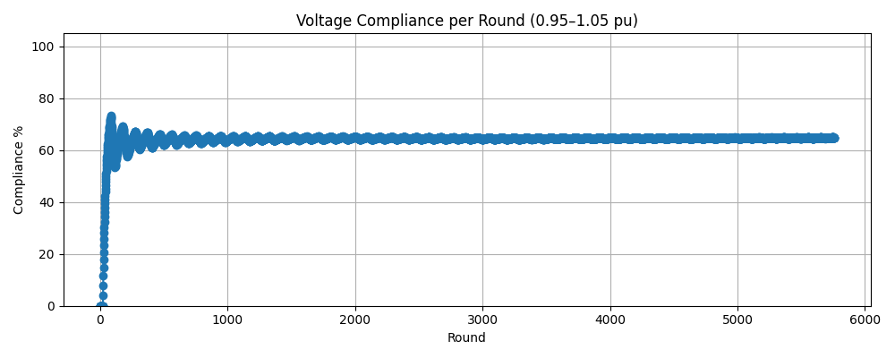

# FedLoRa-RL

**Applied AI for privacy-aware, communication-efficient EV and distributed energy resource coordination.**

FedLoRa-RL is a physics-informed federated deep reinforcement learning project for coordinating electric-vehicle charging, photovoltaic generation, household battery storage, and a public charging station without centralizing clients' raw data.

The system combines **Soft Actor-Critic (SAC)**, **Federated Learning**, **Low-Rank Adaptation (LoRA)**, real energy datasets, and three-phase power-flow simulation.



## AI Problem

Large numbers of EVs and distributed energy resources create a continuous decision-making problem:

- when each EV should charge;
- when a battery should charge or discharge;
- how local agents can cooperate without sharing raw user data;
- how to reduce model communication between edge clients and a central server;
- how to keep AI-generated actions within physical grid limits.

FedLoRa-RL treats this as a distributed sequential-control problem and trains multiple AI agents to make continuous energy-management decisions.

## Core AI Components

### Deep Reinforcement Learning

Each household uses a Soft Actor-Critic agent to learn two continuous control actions:

1. EV charging rate;
2. battery charge or discharge rate.

The agents learn from local EV, solar, demand, battery, and grid observations.

### Federated Learning

Clients train locally and send model updates to a central aggregator. Raw charging sessions, load profiles, photovoltaic measurements, and battery states remain on the client side.

### Low-Rank Adaptation

LoRA adapters are inserted into the actor and critic networks. Instead of transmitting the complete neural-network weights, clients exchange only compact low-rank parameters.

### Physics-Informed Learning

AI actions are evaluated through an unbalanced IEEE 34-bus power-flow model. The reward function penalizes unsafe or inefficient behavior, including:

- voltage-limit violations;
- line-current violations;
- insufficient battery state of charge;
- abrupt control changes;
- unfair power allocation;
- failed power-flow convergence.

### Data Engineering

The project includes preprocessing and alignment of:

- 15-minute photovoltaic generation data;
- residential electricity-demand data;
- real EV charging-session records;
- derived physical features such as photovoltaic efficiency and power factor.

## AI Workflow

```text
Local EV, PV, load and battery data
                |
                v
       Client observation state
                |
                v
      LoRA-enabled SAC agent
                |
                v
 EV charging + battery control actions
                |
                v
 Three-phase power-flow verification
                |
                v
 Physics-informed reward and local training
                |
                v
      LoRA-only parameter updates
                |
                v
       Federated model aggregation
```

The public charging station uses a separate SAC agent because its multi-plug action space differs from the household-agent action space.

## Reported Experimental Outcomes

In the evaluated research configuration, the framework demonstrated:

- up to **98% lower model-update communication** compared with full-model transmission;
- **100% voltage-band compliance** within the evaluated 0.95-1.05 pu operating range;
- **100% power-flow convergence** across the reported simulation;
- coordinated EV charging and battery control without centralizing raw client data.

These results are specific to the tested simulation configuration and should not be interpreted as guaranteed real-world grid performance.

## Applied AI Skills Demonstrated

- Deep reinforcement learning
- Continuous-control policy learning
- Federated and distributed AI
- Neural-network parameter-efficient fine-tuning
- Multi-agent environment design
- Reward engineering
- Time-series data preprocessing
- Physics-informed machine learning
- Simulation-based AI evaluation
- Communication-efficiency analysis
- PyTorch model development
- Energy-system optimization

## Technology Stack

- Python
- PyTorch
- Stable-Baselines3
- Soft Actor-Critic
- Federated Averaging
- Low-Rank Adaptation
- Pandapower
- NumPy
- Pandas
- Gymnasium
- Matplotlib
- Jupyter Notebook

## Repository Structure

| File | Description |
|---|---|
| `Lora_integrated_der.py` | Main LoRA-enabled federated SAC implementation |
| `der_integration_50_client_household_+_1_public_charging_station_simulation_physics_informed_two_global_3_phase_feeder.py` | Full EV, DER, public-station, and grid simulation |
| `feeder.py` | IEEE 34-bus feeder construction and validation |
| `ieee34_feeder.pkl` | Serialized feeder model |
| `cleaned_aligned_15min_pv_load_physics.csv` | Aligned photovoltaic, load, and physics-feature data |
| `cleaned_ev_charging_test.csv` | Preprocessed EV charging-session data |
| `3 client Test results.ipynb` | Experiment and result-analysis notebook |
| `gputest.py` | GPU and PyTorch environment test |
| `graph.png` | Project architecture diagram |
| `requirements.txt` | Python dependencies |

## Installation

```bash
git clone <repository-url>
cd FedLoRa-RL

python -m venv .venv
```

Activate the environment:

```bash
# Windows PowerShell
.venv\Scripts\Activate.ps1

# Linux or macOS
source .venv/bin/activate
```

Install the dependencies:

```bash
python -m pip install --upgrade pip
pip install -r requirements.txt
```

A CUDA-capable GPU is recommended for larger experiments.

## Running the Project

Validate or rebuild the feeder:

```bash
python feeder.py
```

Run the LoRA-enabled federated AI experiment:

```bash
python Lora_integrated_der.py
```

Open the experiment notebook:

```bash
jupyter notebook "3 client Test results.ipynb"
```

## Main Configuration

The implementation supports configuration of:

- number of federated clients;
- number of global communication rounds;
- local SAC training steps;
- LoRA rank and scaling factor;
- episode duration;
- battery capacity;
- public-station plug count;
- voltage and line-current limits;
- client-to-bus allocation;
- observation-stack length.

The reported setup uses 15-minute timesteps, 96 steps per daily episode, a four-timestep observation stack, and an operating voltage range of 0.95-1.05 pu.

## Input Data

### Energy time-series data

`cleaned_aligned_15min_pv_load_physics.csv` contains aligned photovoltaic and household-demand measurements together with variables used to derive physics-based features.

### EV charging data

`cleaned_ev_charging_test.csv` contains charging-session features such as requested energy, delivered energy, charging duration, maximum charging power, time of day, and remaining energy demand.

## Evaluation Metrics

The system evaluates both AI performance and physical feasibility through:

- cumulative agent reward;
- EV energy delivery;
- EV and battery state of charge;
- minimum and maximum feeder voltage;
- voltage-compliance rate;
- maximum line current;
- ampacity-compliance rate;
- power-flow convergence;
- client power-allocation fairness;
- communication payload per client;
- LoRA compression relative to full-model updates.

## Important Limitations

This repository is a research prototype, not production grid-control software.

Federated learning reduces raw-data sharing, but it does not automatically provide formal privacy protection. Production deployment would require additional mechanisms such as secure aggregation, differential privacy, authentication, encrypted communication, adversarial testing, and utility-grade safety validation.

The current code may also require replacing machine-specific file paths with repository-relative paths before execution on another system.

## Future Development

Planned improvements include:

- configuration files instead of hard-coded parameters;
- multi-seed and larger-client benchmarking;
- centralized and non-federated AI baselines;
- FedProx and alternative federated RL baselines;
- secure aggregation and differential privacy;
- automated experiment tracking;
- unit and integration tests;
- containerized execution;
- expanded grid and stress-test scenarios.
